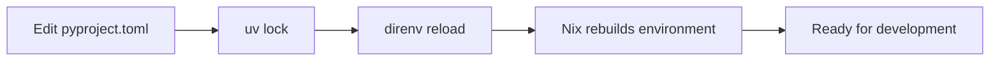

# Agent Usage Guidelines

This document provides guidelines for AI agents working on this Python project template, which uses a sophisticated UV+Nix integration system.

## Project Architecture Overview

This is a **modular Python template** that integrates UV (Python package manager) with Nix (reproducible builds) for a robust development environment.

### Key Technologies
- **UV**: Fast Python package manager and resolver
- **Nix**: Reproducible package management and development environments  
- **UV2NIX**: Custom integration system that bridges UV and Nix
- **Python 3.13**: Latest Python version with modern features

### Directory Structure
```
./
├── AGENT.md                    # This file - agent guidelines
├── README.md                   # Project documentation
├── pyproject.toml             # Python project configuration (UV managed)
├── uv.lock                    # Dependency lock file (UV managed)
├── src/template/              # Python source code
├── tests/                     # Test files
├── nix/                       # Nix configuration (see nix/README.md)
│   ├── uv2nix/               # UV+Nix integration system
│   ├── shells/               # Development environments
│   ├── packages/             # Package definitions
│   ├── apps/                 # Runnable applications
│   └── variants/             # Project templates
└── rename_project.py          # Template customization script
```

## 🧪 Testing Guidelines

### Primary Testing Command
**ALWAYS use this for comprehensive testing:**
```bash
nix flake check
```

### What `nix flake check` does:
- Runs Python tests with pytest and coverage
- Validates all Nix configurations
- Checks all development shells build correctly
- Validates all packages and applications
- Ensures the entire system is consistent

### Running Specific Tests

**All specific test commands should be run within the proper environment:**

#### Run All Python Tests
```bash
# Comprehensive test workflow (recommended)
nix run .#test-all

# Run all Python tests in development shell
nix develop --command pytest --cov

# Run all tests with verbose output
nix develop --command pytest --cov -v
```

#### Run Specific Test Files
```bash
# Run a specific test file
nix develop --command pytest tests/test_template.py

# Run a specific test file with coverage
nix develop --command pytest --cov tests/test_template.py

# Run multiple specific test files
nix develop --command pytest tests/test_template.py tests/test_other.py
```

#### Run Specific Test Functions or Classes
```bash
# Run a specific test function
nix develop --command pytest tests/test_template.py::test_package_name

# Run a specific test class
nix develop --command pytest tests/test_template.py::TestTemplateClass

# Run a specific method in a test class
nix develop --command pytest tests/test_template.py::TestTemplateClass::test_method
```

#### Run Tests with Different Options
```bash
# Run tests with detailed output
nix develop --command pytest -v

# Run tests and stop at first failure
nix develop --command pytest -x

# Run tests with coverage report in terminal
nix develop --command pytest --cov --cov-report=term-missing

# Run tests with HTML coverage report
nix develop --command pytest --cov --cov-report=html

# Run tests matching a pattern
nix develop --command pytest -k "test_main"

# Run tests with markers (if defined)
nix develop --command pytest -m "slow"
```

#### Testing in Different Environments
```bash
# Run tests in testing shell (includes testing tools)
nix develop .#testing --command pytest --cov

# Run tests in full environment
nix develop .#full --command pytest --cov

# Run tests in minimal Python environment
nix develop .#python --command pytest
```

### Alternative Method (if nix develop fails)
If you encounter issues with `nix develop --command`, you can enter the shell first:
```bash
# Enter the development environment
nix develop

# Then run tests directly (now in proper environment)
pytest tests/test_template.py::test_package_name -v
pytest --cov --cov-report=html
pytest -k "test_main" -x
```

### Never use these for testing:
- `pytest` directly outside nix develop (may use wrong environment)
- `python -m pytest` outside nix develop (may miss dependencies)
- `make test` or similar (not part of this system)
- `pip install pytest` (breaks UV dependency management)

### Build and Inspect Test Results
```bash
# Build test results as derivation
nix build .#checks.x86_64-linux.template-pytest

# View the HTML coverage report
nix build .#checks.x86_64-linux.template-pytest
ls result/  # Contains HTML coverage report

# Run tests and view coverage in browser
nix develop --command pytest --cov --cov-report=html
open htmlcov/index.html  # or xdg-open on Linux
```

## 📦 Package Management Guidelines

### ✅ Correct Package Management

**Adding dependencies:**
```bash
# Add a runtime dependency
uv add requests

# Add a development dependency  
uv add --dev pytest-mock

# Add to specific optional dependency group (testing, docs, etc.)
uv add --optional-dependencies testing pytest-mock
uv add --optional-dependencies docs sphinx

# Lock dependencies after changes
uv lock

# Reload environment to pick up changes
direnv reload
```

**Editing dependencies manually:**
```bash
# 1. Edit pyproject.toml directly
# 2. Lock the changes
uv lock

# 3. Reload environment
direnv reload
```

### ❌ Never Use
- `pip install` - Bypasses UV and breaks dependency resolution
- `pip freeze` - Not compatible with UV's system
- `requirements.txt` - Use pyproject.toml instead
- `conda` - Conflicts with Nix environment management

### Why UV + Nix?
- **UV**: Fast dependency resolution and virtual environment management
- **Nix**: Reproducible system-level dependencies and development environments
- **UV2NIX**: Bridges the two systems for the best of both worlds

## 🔧 Development Environment

### Entering Development Environment
```bash
# Default development environment (base tools + Python)
nix develop

# Specialized environments with UV-managed Python dependencies
nix develop .#minimal    # Just base tools, no Python
nix develop .#testing    # Base + testing dependency group from pyproject.toml
nix develop .#docs       # Base + docs dependency group from pyproject.toml
nix develop .#full       # Base + testing + docs dependency groups
```

### Available Commands in Environment
```bash
# Check environment status
nix run .#status

# Clean project artifacts
nix run .#clean

# Format code
nix run .#format-all

# Run linting
nix run .#lint-all
```

## 🏗️ UV2NIX Integration System

### How It Works
The UV2NIX system automatically:
1. **Discovers workspaces** from pyproject.toml
2. **Resolves dependencies** using UV's fast resolver
3. **Creates Nix packages** for all dependencies
4. **Builds virtual environments** with proper isolation
5. **Provides development shells** with all tools

### Key Files
- `nix/uv2nix/` - The integration system (see [README](./nix/uv2nix/README.md))
- `pyproject.toml` - Python project definition (UV managed)
- `uv.lock` - Dependency lock file (UV managed)
- `nix/python.nix` - Project metadata for Nix

### Workflow Integration


## 📁 Project Structure Guidelines

### Source Code Organization
```
src/template/
├── __init__.py          # Package initialization, version info
├── main.py              # Main entry point with CLI
└── ...                  # Additional modules
```

### Test Organization
```
tests/
├── __init__.py          # Test package initialization  
├── test_template.py     # Main functionality tests
└── ...                  # Additional test modules
```

### Configuration Files
- **pyproject.toml**: Python project config, dependencies, tools
- **uv.lock**: Dependency lock file (auto-generated by UV)
- **nix/**: All Nix configuration (see individual READMEs)

## 🔄 Common Workflows

### Adding a New Dependency
```bash
# 1. Add the dependency
uv add numpy

# 2. Lock dependencies
uv lock

# 3. Reload environment (if using direnv)
direnv reload

# 4. Test the change
nix flake check
```

### Adding a New Development Tool
```bash
# Add to dev dependencies
uv add --dev black

# Update lock file
uv lock

# Reload environment
direnv reload

# Test everything still works
nix flake check
```

### Creating a New Test
```python
# In tests/test_new_feature.py
import pytest
from template.new_feature import some_function

def test_some_function():
    """Test the new functionality."""
    result = some_function("input")
    assert result == "expected_output"
```

```bash
# Run tests
nix flake check
```

### Adding a New Python Module
```python
# In src/template/new_module.py
"""New module for additional functionality."""

def new_function():
    """A new function."""
    return "Hello from new module"
```

```python
# Update src/template/__init__.py
__all__ = [
    "main", 
    "__version__", 
    "__package_name__",
    "new_function",  # Add new exports
]

from .new_module import new_function
```

## 🚨 Important Warnings

### Never Modify These Files Directly
- `uv.lock` - Managed by UV, always use `uv lock`
- `nix/` generated files - Use the appropriate commands instead

### Always Run After Changes
```bash
# After any pyproject.toml changes
uv lock
direnv reload

# After any nix/ changes  
nix flake check
```

### Environment Isolation
- Always work within `nix develop` for consistency
- Don't install packages globally that conflict with the project
- Use the provided apps (`nix run .#<name>`) instead of global tools

## 🎯 Best Practices

### Code Quality
- Use the provided formatters: `nix run .#format-all`
- Run linting: `nix run .#lint-all`  
- Always run tests: `nix flake check`

### Dependency Management  
- Pin versions in pyproject.toml when needed
- Use optional dependency groups for different use cases
- Keep development dependencies separate from runtime dependencies

### Testing
- Write tests for all new functionality
- Use pytest fixtures and parameterization
- Aim for high test coverage (current target: >80%)

### Documentation
- Update docstrings for new functions/classes
- Update README.md for major changes
- Keep AGENT.md updated when workflows change

## 🔍 Troubleshooting

### Common Issues

**"Command not found" in development shell:**
```bash
# Reload the environment
direnv reload
# or enter the shell again
nix develop
```

**Dependency conflicts:**
```bash
# Re-resolve dependencies
uv lock --upgrade
direnv reload
```

**Tests failing after dependency changes:**
```bash
# Clean and rebuild everything
nix run .#clean
nix flake check
```

**Nix evaluation errors:**
```bash
# Check flake syntax
nix flake check --dry-run

# See detailed error information
nix develop --show-trace
```

### Getting Help
- Check `nix/README.md` for architecture overview
- Check individual `nix/*/README.md` for specific subsystems
- Use `nix run .#status` to check environment health
- Use `nix flake show` to see all available commands

## 📚 Learning Resources

### Understanding This Template
1. Read `nix/README.md` - Overall architecture
2. Read `nix/uv2nix/README.md` - UV+Nix integration  
3. Read `nix/shells/README.md` - Development environments
4. Read `nix/packages/README.md` - Package system
5. Read `nix/apps/README.md` - Application system

### External Documentation
- [UV Documentation](https://docs.astral.sh/uv/) - Python package management
- [Nix Manual](https://nixos.org/manual/nix/stable/) - Nix package manager
- [Python Packaging](https://packaging.python.org/) - Modern Python packaging

---

**Remember**: This template prioritizes reproducibility, modularity, and developer experience. When in doubt, use the provided commands and stick to the established patterns.
